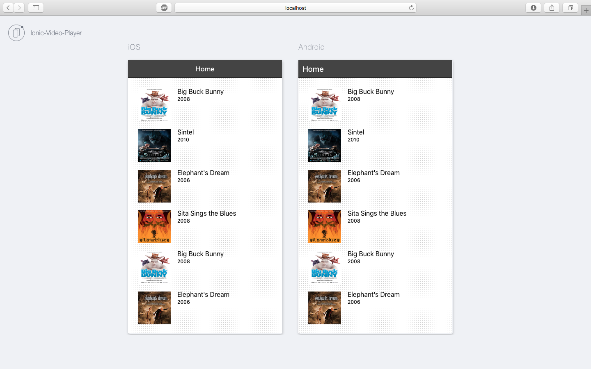
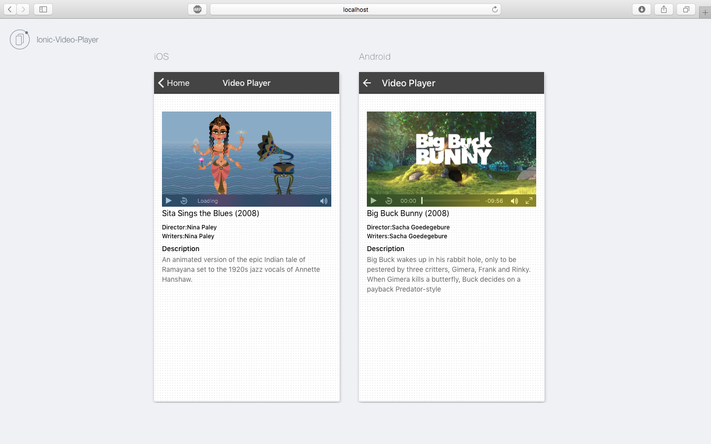

# Ionic-Video-App

## Build

npm install  

bower install

ionic serve to test on browser

ionic emulate iOS to test on ios emulator

# How to use

Click on movie thumbnail will take to detail view, where user can see movie and details.

## Result

 

